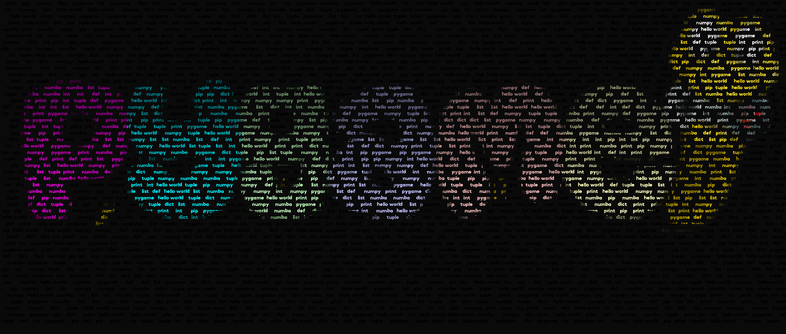

# Text-Img
 Convert an image to an image with a bunch of transparent texts 

 example input: 
 img: img.png
 font: font.otf
 font-size: 24
 background_color: 0,0,0

 Write the words that you want to have in words.txt folder, you can also change the fontfile.

 PLEASE NOTE THAT THE FONTFILE THAT IS INCLUDED WITH THE REPOSITORY IS NOT FOR COMMERCIAL USE. 
 FOR MORE INFORMATION YOU CAN READ THE LICENSE FILE OF THE FONTFILE.